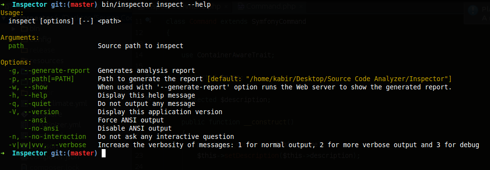
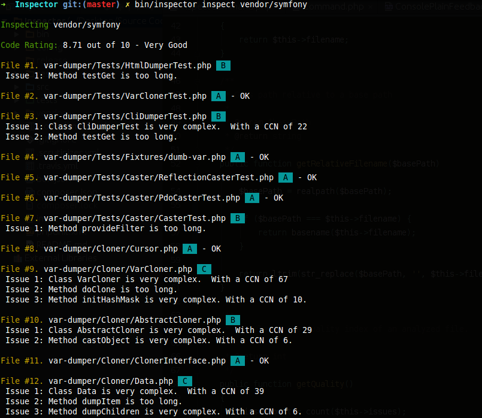
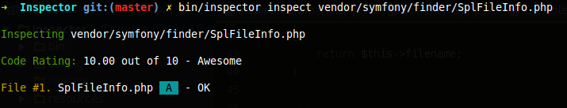
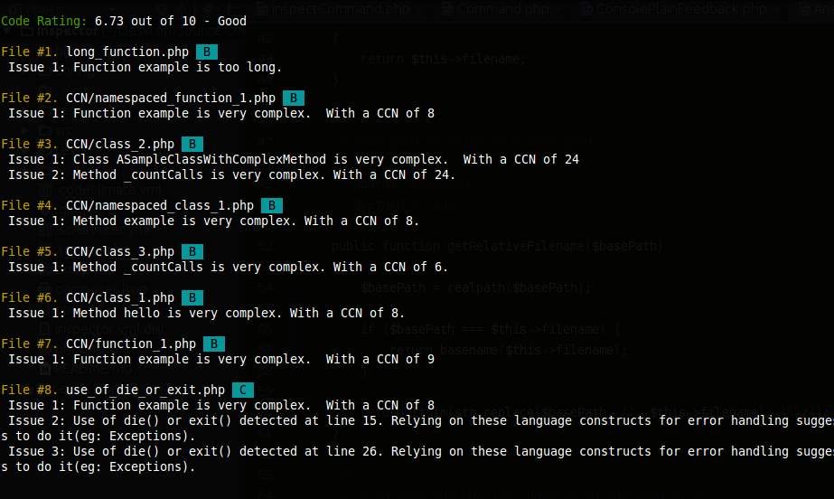
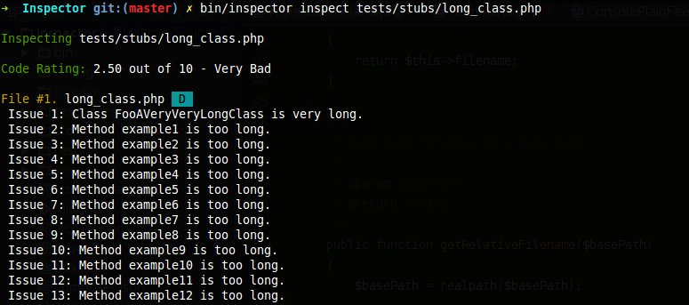
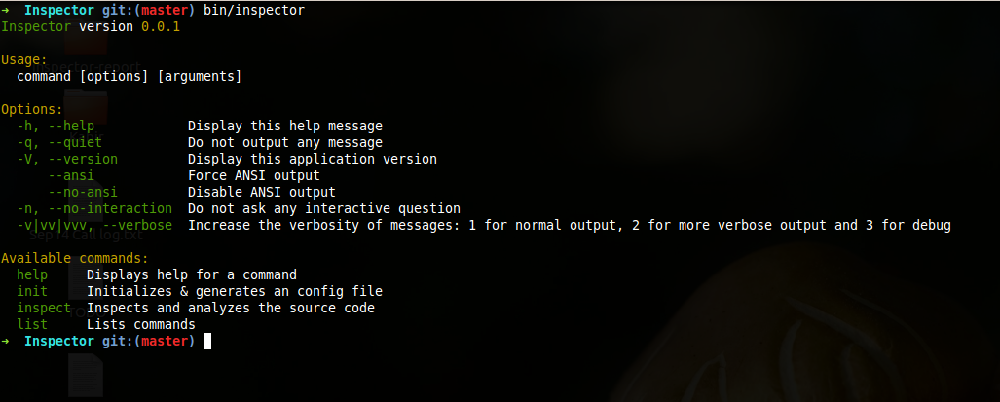
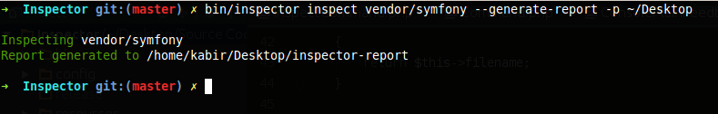
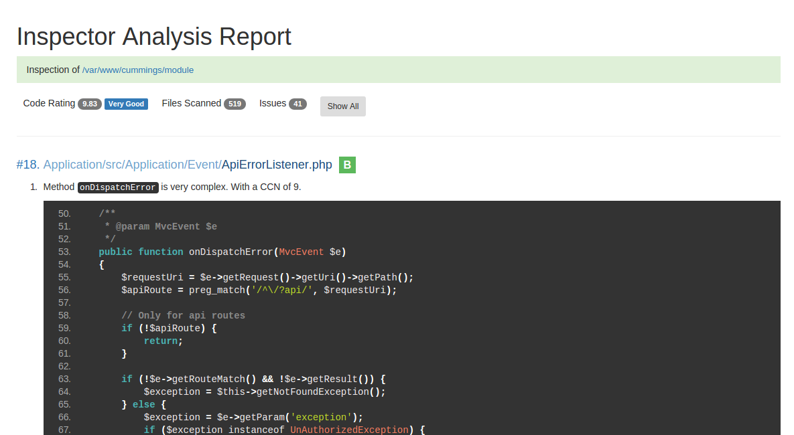
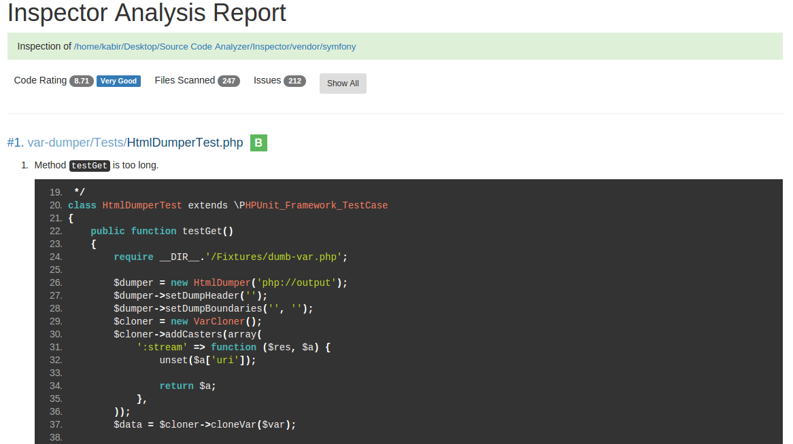
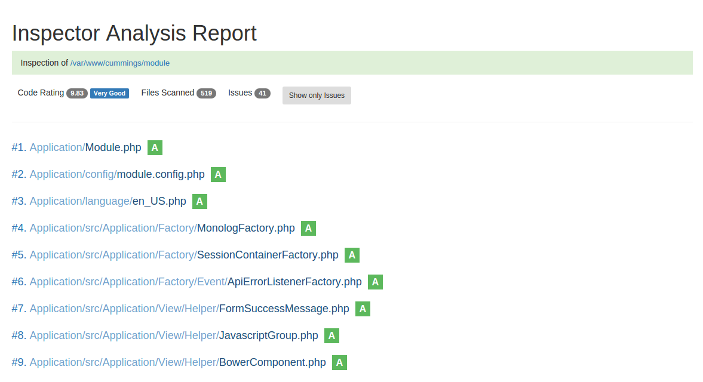

# Inspector

A source code analyzer for PHP.

### Screenshots

#### 

#### 

#### 

#### 

#### 

#### 

#### 

#### 

#### 

#### 

### Dependencies

* PHP 5.5.9+
* [PhpParser](https://github.com/nikic/PHP-Parser)
* [Symfony Console](https://github.com/symfony/Console)

### Contribution guidelines

* Code should strictly conform to [PSR-2](http://www.php-fig.org/psr/psr-2/)
* [PSR-4](http://www.php-fig.org/psr/psr-4/) should be used for Autoloading.
* Write unit tests based on [PHPUnit](https://github.com/sebastianbergmann/phpunit)
